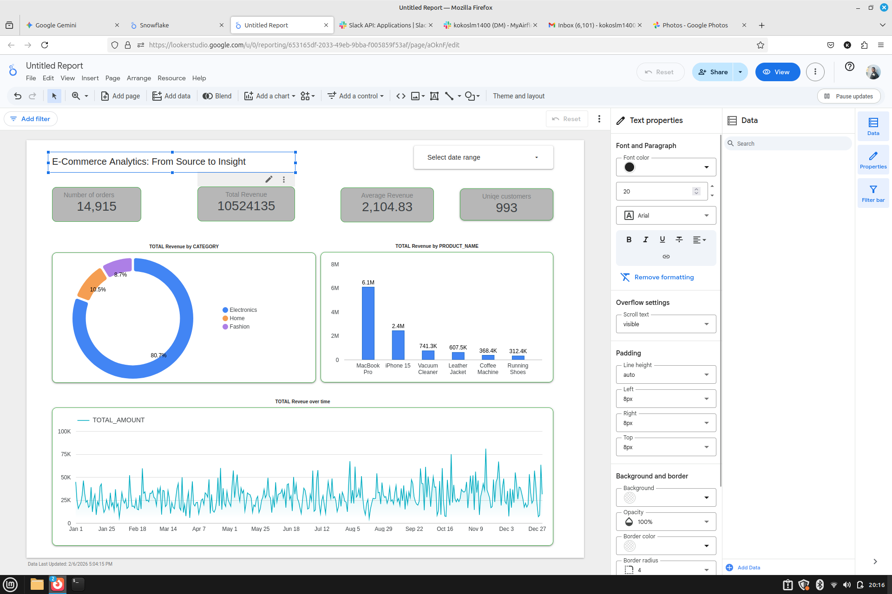

# 🚀 E-Commerce End-to-End Data Pipeline

An automated, modern data stack pipeline that synchronizes transactional data from a MySQL source to a Snowflake Data Warehouse, utilizing dbt for modeling and Airflow for orchestration.

## 📌 Project Overview
This project simulates a real-world E-commerce data environment. It handles everything from infrastructure provisioning and data ingestion to complex SQL transformations, resulting in a clean, query-ready **Star Schema** that powers business-critical insights.

## 🏗️ Technical Architecture
* **Source Database:** `MySQL` (Transactional data).
* **Orchestration:** `Apache Airflow` (Dockerized) to schedule and monitor the pipeline.
* **Infrastructure:** `Terraform` (Infrastructure as Code) to manage Snowflake resources.
* **Data Warehouse:** `Snowflake` (Cloud storage and compute).
* **Transformation:** `dbt` (Data Build Tool) for modular, version-controlled SQL modeling.
* **Visualization:** `Looker Studio` for interactive BI reporting and real-time dashboarding.
* **Environment:** `Docker` & `GitHub Codespaces` for consistent development.

## 🛠️ Implementation Steps

### 1. Infrastructure Provisioning
Used **Terraform** to define the cloud environment. This included creating the `ECOMMERCE_RAW_DB` database, the `LANDING_ZONE` schema, and the compute warehouses in **Snowflake**.

### 2. Data Ingestion (ELT)
A custom **Airflow DAG** was developed to:
* Generate mock e-commerce data (Customers, Products, Sales).
* Populate a MySQL database.
* Automate the transfer of raw records from MySQL to the Snowflake Landing Zone on an hourly schedule (`catchup=False`).

### 3. Data Transformation (dbt)
Implemented a multi-layered modeling approach:
* **Staging Layer:** Cleaned raw data, handled case sensitivity, and renamed columns (e.g., fixing `DATE_ID` identifiers) for consistency.
* **Core Layer:** Built the final **Star Schema** with optimized Dimension and Fact tables:
    * `stg_customers`: Verified customer profiles.
    * `stg_products`: Product categorization and pricing.
    * `final_sale_report`: A centralized reporting view joining sales transactions with customer and product dimensions.

## 📊 4. Data Visualization (The Insights)
The final stage of the pipeline transforms processed data into actionable business intelligence using **Looker Studio**.

> **🔗 Explore the Live Report:** [Interactive E-Commerce Sales Dashboard](https://lookerstudio.google.com/reporting/653165df-2033-49eb-9bba-f005859f53af)

### Key Metrics Tracked:
* **Total Revenue:** Real-time tracking of gross sales (Exceeding $10M).
* **Category Analysis:** Visual breakdown showing Electronics as the leading category (80.7%).
* **Sales Trends:** Time-series analysis for daily and monthly fluctuations.

## 📂 Repository Structure
* `/terraform`: Snowflake infrastructure configuration (`.tf` files).
* `/dbt_ecommerce`: dbt project folder containing `models/staging` and `models/core`.
* `/airflow/dags`: Python scripts for pipeline orchestration (`ecommerce_pipeline.py`).
* `/scripts`: SQL and Python scripts for data generation and database initialization.

## 🚀 Key Learning Outcomes
* **End-to-End Integration:** Successfully linked disparate systems (MySQL ➔ Airflow ➔ Snowflake ➔ dbt ➔ Looker Studio).
* **Dimensional Modeling:** Applied Kimbal techniques to turn raw logs into a structured Star Schema.
* **Modern Data Stack:** Gained hands-on experience with industry-standard tools for ELT and Data Governance.
* **Troubleshooting:** Resolved complex environment issues, including Python syntax errors in Airflow and Snowflake identifier case sensitivity.

---
**Built by Abubakar - Data Engineering Portfolio Project**