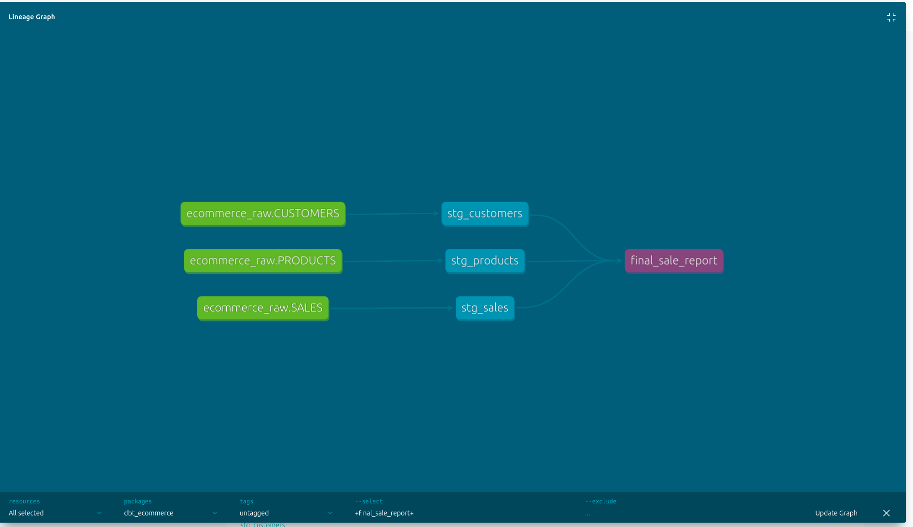

# 🚀 E-Commerce End-to-End Data Pipeline

An automated, modern data stack pipeline that synchronizes transactional data from a **MySQL** source to a **Postgres (Local DW)** and **Snowflake (Cloud DW)**, utilizing **dbt** for modeling and **Airflow** for orchestration.

## 📌 Project Overview
This project simulates a real-world E-commerce data environment. It handles everything from infrastructure provisioning and data ingestion to complex SQL transformations, resulting in a clean, query-ready **Star Schema** that powers business-critical insights.

## 🏗️ Technical Architecture
* **Source Database:** `MySQL` (Transactional data).
* **Intermediate DW:** `Postgres` (Local storage for landing zone data).
* **Cloud Data Warehouse:** `Snowflake` (Cloud storage and compute).
* **Orchestration:** `Apache Airflow` (Dockerized) to schedule and monitor the pipeline.
* **Transformation:** `dbt` (Data Build Tool) for modular, version-controlled SQL modeling.
* **Infrastructure:** `Terraform` (IaC) to manage Snowflake resources.
* **Visualization:** `Looker Studio` for interactive BI reporting.

## 🛠️ Key Technical Challenges & Solutions

### 1. Handling Relational Constraints (Postgres)
* **Challenge:** Encountered `psycopg2.errors.DependentObjectsStillExist` during pipeline re-runs. This happened because Postgres prevents dropping tables (like `DIM_DATES`) that have active Foreign Key references in other tables.
* **Solution:** Decoupled the **Landing Zone** by removing strict `REFERENCES` constraints in the initial DDL. This made the pipeline **idempotent**, allowing Airflow to drop and recreate tables without manual intervention, while maintaining logical integrity at the transformation layer.

### 2. Database Connectivity in Docker
* **Challenge:** Resolving hostnames between separate containers (MySQL, Postgres, and Airflow).
* **Solution:** Leveraged **Docker Compose** networking and service names as hostnames, ensuring stable internal communication and securing credentials using environment variables.

### 3. Data Ingestion (ELT)
A custom **Airflow DAG** was developed to:
* Generate mock data using a custom Python script (`populate_data.py`).
* Automate the transfer of raw records from MySQL to both Postgres and Snowflake on an hourly schedule (`catchup=False`).

## 📂 Repository Structure
* `/terraform`: Snowflake infrastructure configuration (`.tf` files).
* `/dbt_ecommerce`: dbt project folder containing `models/staging` and `models/core`.
* `/airflow/dags`: Python scripts for pipeline orchestration (`ecommerce_pipeline.py`).
* `/scripts`: SQL and Python scripts for data generation and schema initialization.

### 🏗️ Data Lineage & Documentation
The project leverages **dbt** to maintain a clear and documented data lineage. Below is the automated graph showing the transformation flow from staging views to the final Star Schema report.

    

## 📊 Data Visualization (The Insights)
The final stage of the pipeline transforms processed data into actionable business intelligence using **Looker Studio**.

> **🔗 Explore the Live Report:** [Interactive E-Commerce Sales Dashboard](https://lookerstudio.google.com/reporting/653165df-2033-49eb-9bba-f005859f53af)

## 🚀 Key Learning Outcomes
* **Hybrid Data Warehousing:** Successfully managed data across local (Postgres) and cloud (Snowflake) environments.
* **Dimensional Modeling:** Applied Kimball techniques to turn raw transactional logs into a structured Star Schema.
* **Troubleshooting:** Gained hands-on experience resolving Python/SQL dependency errors and Docker networking issues.

---
**Built by Abubakar - Data Engineering Portfolio Project**